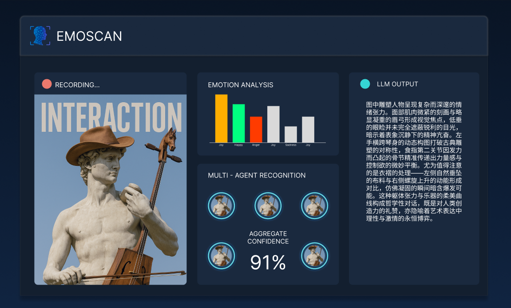

# EmoScan - 智能情感分析桌面应用

<div align="center">



**基于AI的实时情感分析与图像生成桌面应用**

[](GPL)
[](https://python.org)
[](https://nextjs.org)
[](https://electronjs.org)
[](https://fastapi.tiangolo.com)

</div>

## 🌟 项目简介

EmoScan 是一个创新的桌面应用程序，结合了先进的人工智能技术，能够实时分析人脸情感并生成对应的艺术图像。该项目采用现代化的技术栈，提供流畅的用户体验和强大的AI功能。

### ✨ 核心功能

- 🎥 **实时摄像头捕获** - 支持高质量视频流捕获
- 🧠 **多AI情感分析** - 集成OpenAI、Face++等多种AI服务
- 🎨 **ComfyUI图像生成** - 基于情感分析结果生成艺术图像
- 📊 **可视化分析** - 实时情感数据图表和雷达图
- 🌓 **主题切换** - 支持深色/浅色主题
- ⚡ **快速/详细模式** - 灵活的分析模式选择
- 💾 **批量处理** - 支持多图像批量分析

## 🏗️ 技术架构

```
┌─────────────────┐    ┌─────────────────┐    ┌─────────────────┐
│   Frontend      │    │    Backend      │    │    ComfyUI      │
│                 │    │                 │    │                 │
│ Next.js + React│◄──►│ FastAPI + Python│◄──►│ Image Generation│
│ Electron        │    │ AI Services     │    │ Custom Nodes    │
│ TypeScript      │    │ RESTful API     │    │ Workflows       │
└─────────────────┘    └─────────────────┘    └─────────────────┘
```

### 🎯 项目结构

```
faceana-mtq/
├── src/
│   ├── _frontend/         # Next.js + Electron 前端
│   │   ├── app/          # Next.js 应用页面
│   │   ├── components/   # React 组件
│   │   ├── hooks/        # 自定义 Hooks
│   │   └── electron/     # Electron 主进程
│   └── _backend/         # FastAPI 后端
│       ├── app/          # 应用主体
│       ├── services/     # AI 服务
│       ├── models/       # 数据模型
│       └── workflows/    # ComfyUI 工作流
├── comfyui/
│   └── custom_nodes/     # ComfyUI 自定义节点
├── docs/                 # 项目文档
├── test/                 # 测试文件
├── _expriments/         # 开发记录
└── output/              # 输出文件
```

## 🚀 快速开始

### 📋 环境要求

- **Node.js** 18.0+ 
- **Python** 3.8+
- **ComfyUI** (可选，用于图像生成)
- **摄像头** (用于实时捕获)

### 🔧 安装步骤

1. **克隆项目**
```bash
git clone https://github.com/weisiren000/faceana-mtq.git
cd faceana-mtq
```

2. **安装前端依赖**
```bash
cd src/_frontend
npm install
# 或使用 pnpm
pnpm install
```

3. **安装后端依赖**
```bash
cd ../src/_backend
# 推荐使用 uv
uv pip install -r requirements.txt
# 或使用 pip
pip install -r requirements.txt
```

4. **配置环境变量**
```bash
# 在 src/_backend 目录创建 .env 文件
cp .env.example .env
# 编辑 .env 文件，添加必要的API密钥
```

### 🏃‍♂️ 运行应用

1. **启动后端服务**
```bash
cd src/_backend
python start_server.py
# 或使用 uvicorn
uvicorn app.main:app --reload --host 0.0.0.0 --port 8000
```

2. **启动前端应用**
```bash
cd src/_frontend
# 开发模式
npm run electron-dev
# 或分别启动
npm run dev          # Next.js 开发服务器
npm run electron     # Electron 应用
```

3. **访问应用**
- 后端API: http://localhost:8000
- API文档: http://localhost:8000/docs
- 桌面应用会自动启动

## 🎮 使用指南

### 基本操作

1. **启动扫描** - 点击"START SCAN"按钮开始情感分析
2. **选择模式** - 快速模式(~5秒)或详细模式(~20秒)
3. **查看结果** - 实时查看情感分析结果和生成的图像
4. **主题切换** - 使用右上角按钮切换深色/浅色主题

### 分析模式

- **🚀 快速模式**: 分析最后1张图片，适合快速预览
- **🔍 详细模式**: 分析全部5张图片，使用裁判员AI给出综合判断

### API接口

```bash
# 健康检查
GET /health

# 单图情感分析
POST /api/v1/analyze/image

# 批量情感分析
POST /api/v1/analyze/batch

# 分析并生成图像
POST /api/v1/analyze-and-generate
```

## 🛠️ 开发指南

### 前端开发

```bash
cd src/_frontend
npm run dev          # 启动开发服务器
npm run build        # 构建生产版本
npm run export       # 导出静态文件
npm run electron-pack # 打包桌面应用
```

### 后端开发

```bash
cd src/_backend
python start_server.py --reload  # 开发模式
pytest                           # 运行测试
```

### 测试

```bash
# 运行所有测试
cd test
python -m pytest

# 运行特定测试
python test_api.py
python test_comfyui.py
```

## 📚 技术栈详情

### 前端技术
- **Next.js 15.2.4** - React 全栈框架
- **React 19** - 用户界面库
- **TypeScript 5** - 类型安全
- **Electron 36.3.2** - 桌面应用框架
- **Tailwind CSS** - 样式框架
- **Radix UI** - 组件库

### 后端技术
- **FastAPI** - 现代 Python Web 框架
- **Uvicorn** - ASGI 服务器
- **Pydantic** - 数据验证
- **OpenAI API** - AI 服务
- **Face++ API** - 人脸识别

### AI集成
- **ComfyUI** - 图像生成工作流
- **多AI模型** - OpenAI、Face++等
- **实时处理** - 异步并发处理

## 🤝 贡献指南

我们欢迎所有形式的贡献！请查看 [CONTRIBUTING.md](CONTRIBUTING.md) 了解详细信息。

### 开发流程

1. Fork 项目
2. 创建功能分支 (`git checkout -b feature/AmazingFeature`)
3. 提交更改 (`git commit -m 'Add some AmazingFeature'`)
4. 推送到分支 (`git push origin feature/AmazingFeature`)
5. 创建 Pull Request

## 📄 许可证

本项目采用 MIT 许可证 - 查看 [LICENSE](LICENSE) 文件了解详情。

## 🙏 致谢

- [OpenAI](https://openai.com) - AI 模型支持
- [Face++](https://www.faceplusplus.com) - 人脸识别服务
- [ComfyUI](https://github.com/comfyanonymous/ComfyUI) - 图像生成框架
- [Next.js](https://nextjs.org) - React 框架
- [FastAPI](https://fastapi.tiangolo.com) - Python Web 框架

## 📞 联系我们

- 项目主页: [GitHub Repository](https://github.com/your-username/faceana-mtq)
- 问题反馈: [Issues](https://github.com/your-username/faceana-mtq/issues)
- 文档: [Documentation](docs/)

---

<div align="center">

**⭐ 如果这个项目对你有帮助，请给我们一个星标！**

Made with ❤️ by EmoScan Team

</div>
