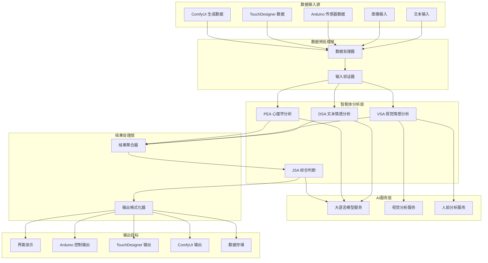
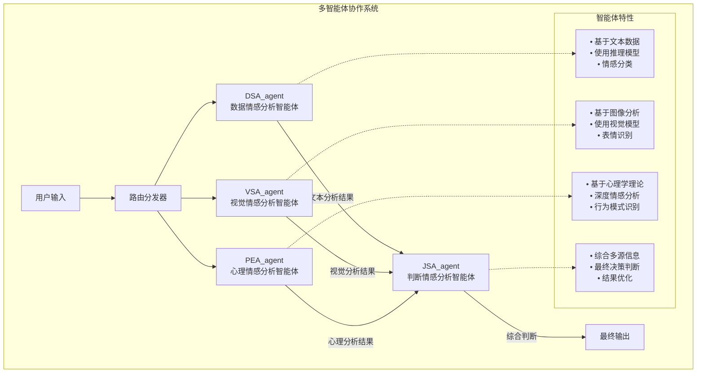

# FaceAna-MTQ 项目架构图

## 系统整体架构

```mermaid
graph TB
    %% 用户界面层
    subgraph "用户界面层"
        UI[Python Flet 前端界面]
    end

    %% 主控制层
    subgraph "主控制层"
        MainCtrl[主控程序<br/>src/main.py]
    end

    %% 前端层
    subgraph "前端服务层"
        FrontendMain[前端主控<br/>src/_frontend/main.py]
        FrontendConfig[前端配置<br/>src/_frontend/config.py]

        subgraph "前端组件"
            Components[组件模块<br/>src/_frontend/components/]
            Views[视图模块<br/>src/_frontend/views/]
            FrontendCore[核心模块<br/>src/_frontend/core/]
            FrontendUtils[工具模块<br/>src/_frontend/utils/]
        end
    end

    %% 后端层
    subgraph "后端服务层"
        BackendMain[后端主控<br/>src/_backend/main.py]
        BackendConfig[后端配置<br/>src/_backend/config.py]

        subgraph "智能体系统"
            DSA[DSA_agent<br/>数据情感分析智能体]
            VSA[VSA_agent<br/>视觉情感分析智能体]
            PEA[PEA_agent<br/>心理情感分析智能体]
            JSA[JSA_agent<br/>判断情感分析智能体]
        end

        subgraph "API集成层"
            OpenAI_API[OpenAI API<br/>src/_backend/api/openai.py]
            Anthropic_API[Anthropic API<br/>src/_backend/api/anthropic.py]
            Gemini_API[Gemini API<br/>src/_backend/api/gemini.py]
            OpenRouter_API[OpenRouter API<br/>src/_backend/api/openrouter.py]
            FacePP_API[Face++ API<br/>src/_backend/api/facepp.py]
        end

        subgraph "模型管理层"
            OpenAI_Model[OpenAI 模型<br/>src/_backend/model/openai.py]
            Anthropic_Model[Anthropic 模型<br/>src/_backend/model/anthropic.py]
            Gemini_Model[Gemini 模型<br/>src/_backend/model/gemini.py]
            OpenRouter_Model[OpenRouter 模型<br/>src/_backend/model/openrouter.py]
        end

        subgraph "核心处理层"
            BackendCore[核心模块<br/>src/_backend/core/]
            BackendUtils[工具函数<br/>src/_backend/utils/]
            PromptManager[提示词管理<br/>src/_backend/utils/prompt.py]
        end
    end

    %% 外部系统集成层
    subgraph "外部系统集成"
        Arduino[Arduino Link<br/>src/arduino_link/]
        ComfyUI[ComfyUI Link<br/>src/comfyui_link/]
        TouchDesigner[TouchDesigner Link<br/>src/touchdesigner_link/]
    end

    %% 外部服务
    subgraph "外部AI服务"
        OpenAI_Service[OpenAI 服务]
        Anthropic_Service[Anthropic 服务]
        Gemini_Service[Google Gemini 服务]
        OpenRouter_Service[OpenRouter 服务]
        FacePP_Service[Face++ 服务]
    end

    %% 配置和文档
    subgraph "配置与文档"
        GlobalConfig[全局配置<br/>src/config.py]
        Requirements[依赖管理<br/>requirements.txt]
        Docs[文档<br/>docs/]
    end

    %% 连接关系
    UI --> MainCtrl
    MainCtrl --> FrontendMain
    MainCtrl --> BackendMain

    FrontendMain --> Components
    FrontendMain --> Views
    FrontendMain --> FrontendCore
    FrontendMain --> FrontendUtils
    FrontendMain --> FrontendConfig

    BackendMain --> DSA
    BackendMain --> VSA
    BackendMain --> PEA
    BackendMain --> JSA
    BackendMain --> BackendCore
    BackendMain --> BackendUtils
    BackendMain --> BackendConfig

    DSA --> OpenAI_API
    DSA --> Anthropic_API
    DSA --> Gemini_API
    DSA --> OpenRouter_API

    VSA --> FacePP_API
    VSA --> OpenAI_API
    VSA --> Gemini_API

    PEA --> OpenAI_API
    PEA --> Anthropic_API
    PEA --> OpenRouter_API

    JSA --> OpenAI_API
    JSA --> Anthropic_API
    JSA --> OpenRouter_API

    OpenAI_API --> OpenAI_Model
    Anthropic_API --> Anthropic_Model
    Gemini_API --> Gemini_Model
    OpenRouter_API --> OpenRouter_Model

    OpenAI_API --> OpenAI_Service
    Anthropic_API --> Anthropic_Service
    Gemini_API --> Gemini_Service
    OpenRouter_API --> OpenRouter_Service
    FacePP_API --> FacePP_Service

    BackendMain --> Arduino
    BackendMain --> ComfyUI
    BackendMain --> TouchDesigner

    MainCtrl --> GlobalConfig
    FrontendMain --> GlobalConfig
    BackendMain --> GlobalConfig

    PromptManager --> DSA
    PromptManager --> VSA
    PromptManager --> PEA
    PromptManager --> JSA
```



## 数据流架构



## 技术栈架构

```mermaid
graph LR
    subgraph "开发语言"
        Python[Python]
    end

    subgraph "前端技术"
        Flet[Python Flet]
    end

    subgraph "后端技术"
        FastAPI[FastAPI/Flask<br/>（推测）]
        AsyncIO[异步处理]
    end

    subgraph "AI服务集成"
        OpenAI[OpenAI GPT]
        Anthropic[Anthropic Claude]
        Gemini[Google Gemini]
        OpenRouter[OpenRouter]
        FacePP[Face++ 人脸识别]
    end

    subgraph "外部系统"
        Arduino_HW[Arduino 硬件]
        ComfyUI_AI[ComfyUI AI生成]
        TouchDesigner_VJ[TouchDesigner 视觉]
    end

    subgraph "包管理"
        UV[uv (替代pip)]
        Bun[bun (替代npm)]
    end

    Python --> Flet
    Python --> FastAPI
    Python --> AsyncIO

    FastAPI --> OpenAI
    FastAPI --> Anthropic
    FastAPI --> Gemini
    FastAPI --> OpenRouter
    FastAPI --> FacePP

    FastAPI --> Arduino_HW
    FastAPI --> ComfyUI_AI
    FastAPI --> TouchDesigner_VJ

    Python --> UV
    Flet --> Bun
```

## 智能体协作架构



## 部署架构

```mermaid
graph TB
    subgraph "开发环境"
        DevEnv[本地开发环境<br/>d:\codee\faceana-mtq]
        DevTools[开发工具<br/>• uv (Python包管理)<br/>• bun (前端包管理)<br/>• Git版本控制]
    end

    subgraph "运行时环境"
        MainProcess[主进程<br/>src/main.py]
        FrontendProcess[前端进程<br/>Python Flet应用]
        BackendProcess[后端进程<br/>API服务]
    end

    subgraph "外部依赖"
        AIServices[AI服务<br/>• OpenAI<br/>• Anthropic<br/>• Gemini<br/>• OpenRouter<br/>• Face++]
        HardwareLinks[硬件连接<br/>• Arduino<br/>• TouchDesigner<br/>• ComfyUI]
    end

    DevEnv --> MainProcess
    MainProcess --> FrontendProcess
    MainProcess --> BackendProcess
    BackendProcess --> AIServices
    BackendProcess --> HardwareLinks
```

## 文件结构架构

```
faceana-mtq/
├── docs/                           # 项目文档
│   ├── agent.md                   # 智能体设计文档
│   ├── api-documents.md           # API文档链接
│   ├── arc.md                     # 架构文档
│   ├── idea.md                    # 项目想法
│   └── init/                      # 初始化文档
├── rules/                         # 项目规则
│   └── first_principles.md        # 第一性原理思考
├── src/                           # 源代码目录
│   ├── main.py                    # 主控程序入口
│   ├── config.py                  # 全局配置
│   ├── _frontend/                 # 前端模块
│   │   ├── main.py               # 前端主控
│   │   ├── config.py             # 前端配置
│   │   ├── components/           # UI组件
│   │   ├── core/                 # 前端核心
│   │   ├── utils/                # 前端工具
│   │   └── views/                # 视图模块
│   ├── _backend/                  # 后端模块
│   │   ├── main.py               # 后端主控
│   │   ├── config.py             # 后端配置
│   │   ├── agent/                # 智能体模块
│   │   ├── api/                  # API集成
│   │   │   ├── openai.py         # OpenAI API
│   │   │   ├── anthropic.py      # Anthropic API
│   │   │   ├── gemini.py         # Gemini API
│   │   │   ├── openrouter.py     # OpenRouter API
│   │   │   └── facepp.py         # Face++ API
│   │   ├── model/                # 模型管理
│   │   │   ├── openai.py         # OpenAI 模型
│   │   │   ├── anthropic.py      # Anthropic 模型
│   │   │   ├── gemini.py         # Gemini 模型
│   │   │   └── openrouter.py     # OpenRouter 模型
│   │   ├── core/                 # 后端核心
│   │   └── utils/                # 后端工具
│   │       └── prompt.py         # 提示词管理
│   ├── arduino_link/             # Arduino连接模块
│   ├── comfyui_link/             # ComfyUI连接模块
│   └── touchdesigner_link/       # TouchDesigner连接模块
├── requirements.txt               # Python依赖
├── .env.example                  # 环境变量示例
├── .gitignore                    # Git忽略文件
├── README.md                     # 英文说明文档
└── README-CN.md                  # 中文说明文档
```

## 核心功能模块说明

### 1. 智能体系统 (Agent System)
- **DSA_agent**: 数据情感分析智能体，专注于文本数据的情感分析
- **VSA_agent**: 视觉情感分析智能体，专注于图像和视觉数据的情感识别
- **PEA_agent**: 心理情感分析智能体，基于心理学理论进行深度情感分析
- **JSA_agent**: 判断情感分析智能体，综合多个智能体的结果进行最终判断

### 2. API集成层 (API Integration Layer)
- 集成多个主流AI服务提供商
- 支持多模态AI能力（文本、视觉、推理）
- 提供统一的API调用接口

### 3. 外部系统集成 (External System Integration)
- **Arduino Link**: 与Arduino硬件设备的通信接口
- **ComfyUI Link**: 与ComfyUI AI生成系统的集成
- **TouchDesigner Link**: 与TouchDesigner视觉创作平台的连接

### 4. 前后端分离架构
- 前端使用Python Flet框架，提供跨平台GUI
- 后端提供API服务和核心业务逻辑
- 主控程序协调前后端的启动和通信

