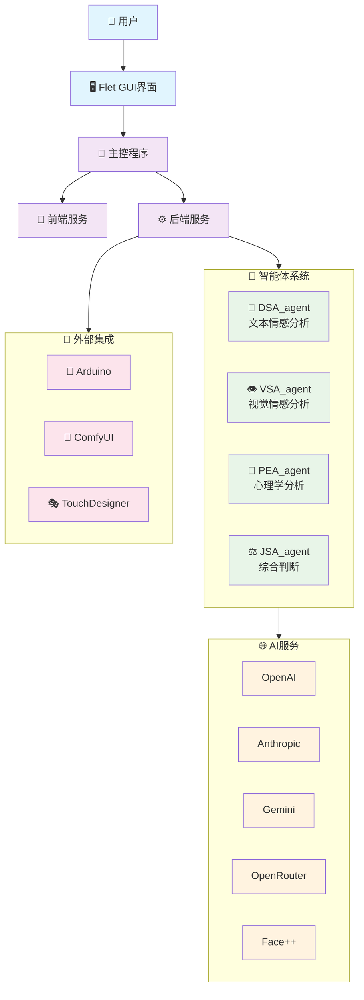
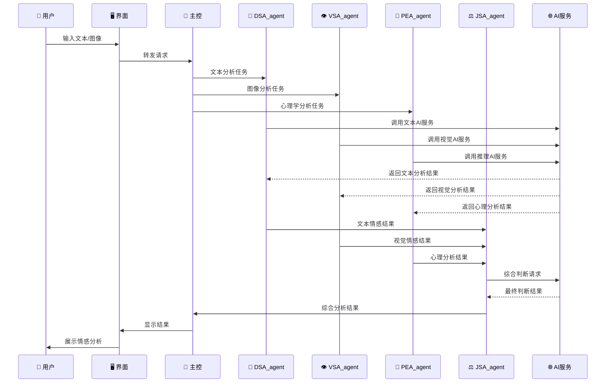

# FaceAna-MTQ 项目概览

## 项目简介
FaceAna-MTQ 是一个基于多智能体协作的情感分析系统，支持文本、图像等多模态输入，并能与外部硬件和创作平台集成。

## 核心特性
- 🤖 **多智能体协作**: 4个专门的情感分析智能体
- 🔗 **多AI服务集成**: OpenAI、Anthropic、Gemini、OpenRouter、Face++
- 🎨 **创作平台集成**: ComfyUI、TouchDesigner
- 🔧 **硬件集成**: Arduino支持
- 🖥️ **跨平台界面**: Python Flet GUI

## 系统架构概览



## 智能体工作流程



## 技术栈

| 层级 | 技术选型 | 说明 |
|------|----------|------|
| **前端** | Python Flet | 跨平台GUI框架 |
| **后端** | Python | 核心业务逻辑 |
| **AI服务** | OpenAI, Anthropic, Gemini, OpenRouter, Face++ | 多AI服务集成 |
| **外部集成** | Arduino, ComfyUI, TouchDesigner | 硬件和创作平台 |
| **包管理** | uv (Python), bun (前端) | 现代化包管理工具 |

## 项目目录结构

```
📁 faceana-mtq/
├── 📁 src/                    # 源代码
│   ├── 🐍 main.py            # 主入口
│   ├── 📁 _frontend/         # 前端模块
│   ├── 📁 _backend/          # 后端模块
│   │   ├── 📁 agent/         # 智能体
│   │   ├── 📁 api/           # API集成
│   │   ├── 📁 model/         # 模型管理
│   │   └── 📁 utils/         # 工具函数
│   ├── 📁 arduino_link/      # Arduino连接
│   ├── 📁 comfyui_link/      # ComfyUI连接
│   └── 📁 touchdesigner_link/ # TouchDesigner连接
├── 📁 docs/                  # 项目文档
├── 📁 rules/                 # 项目规则
├── 📄 requirements.txt       # Python依赖
└── 📄 README.md             # 项目说明
```

## 核心优势

1. **🎯 多模态分析**: 支持文本、图像等多种输入方式
2. **🤖 智能体协作**: 专业化分工，提高分析准确性
3. **🔗 丰富集成**: 支持多个AI服务和外部平台
4. **🛠️ 硬件支持**: Arduino集成，支持物理交互
5. **🎨 创作友好**: 与ComfyUI、TouchDesigner等创作工具集成
6. **📱 跨平台**: Python Flet提供统一的用户界面

## 应用场景

- 🎭 **数字艺术创作**: 结合TouchDesigner进行情感可视化
- 🤖 **智能硬件**: 通过Arduino实现情感感知设备
- 🎨 **AI内容生成**: 与ComfyUI结合生成情感相关内容
- 📊 **情感监测**: 实时分析用户情感状态
- 🧠 **心理健康**: 基于多维度分析提供情感洞察
